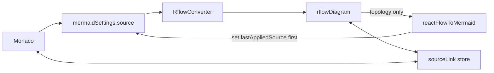

# Flow tab ↔ Monaco source sync

Yes. Today the pipeline is one-way on purpose: Monaco updates [`mermaidSettings.source`](src/store/2-mermaid-settings.ts), [`RflowConverter`](src/features/rflow/ui/RflowConverter.tsx) converts that into [`rflowDiagram`](src/features/rflow/store/1-flow-diagram.ts), and canvas edits stay in Valtio only. Palette drop in [`FlowDiagram.tsx`](src/features/rflow/canvas/FlowDiagram.tsx) calls `setFlowNodes` and never touches the left editor. SVG linking is a separate path: beautiful-mermaid tags the SVG, [`buildSourceIndex`](src/store/6-source-render-links/2-source-index.ts) maps IDs to source lines, and [`sourceLink`](src/store/6-source-render-links/4-source-link.ts) drives caret/click highlight.

Two features, two mechanisms:

## 1. Write canvas topology back to the editor

**What writes back:** add (palette drop), connect / relink, delete, duplicate, node label, edge label, subgraph title.

**What stays canvas-only:** drag, align, distribute, lock, colors, icons, images, z-order. Mermaid flowcharts cannot store pixel positions; writing those would just fight Dagre on the next convert.

**Loop guard (already exists):** [`RflowConverter`](src/features/rflow/ui/RflowConverter.tsx) skips when `source === lastAppliedSource`. Canvas write-back must set `lastAppliedSource` *before* assigning `mermaidSettings.source`, same pattern as [`restoreFlow`](src/features/rflow/store/1-flow-diagram.ts). Otherwise the converter would replace the graph and wipe positions.

**Serializer:** new [`src/features/rflow/converter/reactFlowToMermaid.ts`](src/features/rflow/converter/reactFlowToMermaid.ts).

- Keep the current header (`graph TD` / `flowchart LR`, plus a leading `%%{init}%%` if present). If the source is not a flowchart (sequence/class/ER), do **not** overwrite — toast and skip. Palette add on a failed conversion would otherwise destroy the sample.
- Emit nodes by React Flow type / `data.shape`: rectangle `id[label]`, diamond `id{label}`, stadium `id([label])`, circle `id((label))`, round `id(label)`. Quote labels that need it.
- Emit `subgraph id [title] ... end` from `type === 'group'` (`id` is the mermaid id; RF currently uses `subgraph-${id}`).
- Nest by `parentNode`. Edges use stored mermaid operator when present (`-->`, `---`, `-.->`, `==>`), plus `|label|`.
- Persist `data.shape` and `data.mermaidType` on convert and on new drops/connects so serialize does not reverse-engineer CSS.

**IDs:** stop using `node-${Date.now()}` / `_copy_${timestamp}`. Generate mermaid-safe sequential ids (`n1`, `d1`, `sg1`) so linking and source text stay readable.

**When to sync:** call a single `syncMermaidFromGraph()` after structural mutations only — not from every `onNodesChange` position tick. Cover keyboard delete (`onNodesChange` / `onEdgesChange` with `type === 'remove'`), plus drop, connect, edge update, NodeEditor save, edge-label save, duplicate.

**Monaco caret:** `@monaco-editor/react` `value={source}` will jump the cursor on external writes. Keep an editor ref from [`useMonacoSourceLink`](src/components/2-main/2-editor-page/3-source-diagram-link/1-monaco/1-use-monaco-source-link.ts) and restore view state after canvas-originated `setValue`.

**Cost of this approach:** a topology rewrite drops comments, `classDef` / `style` / `click`, and original wrapping. Incremental AST patches would preserve those but are much more brittle around subgraphs and deletes. Full topology serialize is the reliable first version.

## 2. SVG-style source ↔ Flow linking

Reuse [`sourceLink`](src/store/6-source-render-links/4-source-link.ts) and [`buildSourceIndex`](src/store/6-source-render-links/2-source-index.ts). Do not parse SVG. Build a `CatalogEntry[]` from the React Flow graph:

- node `A` → `{ key: 'node:A', kind: 'node', ids: ['A'] }`
- group `subgraph-foo` → `{ key: 'subgraph:foo', kind: 'subgraph', ids: ['foo'] }`
- edge A→B → `{ key: 'edge:A>B', kind: 'edge', ids: ['A','B'], label? }` (strip the `subgraph-` prefix on endpoints)

New hook `useFlowSourceLink` in [`src/features/rflow/canvas/`](src/features/rflow/canvas/):

- On graph or source change: `setSourceIndex(buildSourceIndex(source, catalog))`.
- Node/edge click → `selectFromDiagram([key])` (Monaco already reveals + line-decorates).
- Subscribe to `sourceLink`: if `origin === 'editor'`, add caret/click CSS on matching RF nodes/edges (same idea as [`8-highlight.css`](src/components/2-main/2-editor-page/3-source-diagram-link/2-diagram/8-highlight.css)); on click intensity, `fitView` that node. Drive **highlight class**, not React Flow `selected`, so a caret in the editor does not arm Delete.
- Pane click → `clearSelection()`.
- Flow and SVG already unmount each other in [`1-preview-panel.tsx`](src/components/2-main/2-editor-page/2-panel-diagrams/1-preview-panel.tsx), so they will not fight over `sourceLink`. Clear on unmount.

Newly dropped nodes only link after write-back puts their id into the source.

## Files to touch

- Add serializer + tests under [`src/features/rflow/converter/`](src/features/rflow/converter/)
- Add `syncMermaidFromGraph` next to [`1-flow-diagram.ts`](src/features/rflow/store/1-flow-diagram.ts)
- Wire structural handlers + mermaid-safe ids + `useFlowSourceLink` in [`FlowDiagram.tsx`](src/features/rflow/canvas/FlowDiagram.tsx), [`NodeEditor.tsx`](src/features/rflow/ui/NodeEditor.tsx), [`diagramEditingUtils.ts`](src/features/rflow/canvas/diagramEditingUtils.ts)
- Editor ref / view-state restore in the Monaco source-link hook
- Highlight CSS for RF nodes/edges
- [`README.md`](README.md): replace “canvas edits do not write back” with topology write-back + Flow linking; keep the positions/styles caveat

## Verify

- Drop a node / diamond / subgraph → left editor gains a definition; converter does not relayout existing nodes.
- Connect two nodes, edit a label, delete → source updates; save/load still restores positions.
- Click a Flow node → Monaco selects the definition line (same as SVG). Caret on that line → node highlight + click pans it into view.
- Sequence sample: Flow still errors; palette does not overwrite the source.
- Switch Flow → SVG: SVG linking still works.
