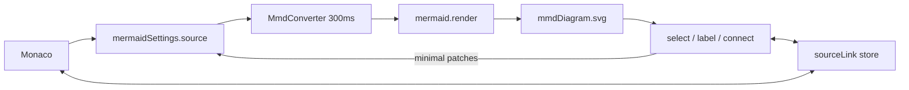

# Official Mermaid tab (custom overlay)

## What this tab is

The left pane stays the existing Monaco editor bound to [`mermaidSettings.source`](src/store/2-mermaid-settings.ts). The new **Mermaid** tab is the right pane: official `mermaid.render()` SVG (the look in the screenshot), not beautiful-mermaid and not React Flow.

Official mermaid has no edit API and flowchart source cannot store pixel positions. Visual editing is an **overlay on mermaid’s SVG**: gestures compile to **small text patches** on the shared source. Dagre/ELK then re-layout. We will **not** take `@inkeep/mermaid-wysiwyg` (npm is GPL-3.0-or-later).



**v1 edit scope:** `graph` / `flowchart` only (select, inline label, add, delete, connect, direction write-back, source↔diagram linking). Sequence / class / ER / XY: official preview + linking + toolbar; no structural write-back.

## Isolation and state

All new code lives under [`src/features/mmd/`](src/features/mmd/). Existing preview files only mount thin adapters (same pattern as [`src/features/rflow/`](src/features/rflow/)).

```
src/features/mmd/
  store/     Valtio diagram + persisted view settings; Jotai chrome
  render/    mermaid.initialize + mermaid.render + theme resolve
  catalog/   official SVG → CatalogEntry; incremental source patches
  canvas/    MermaidView, overlay, source-link hook
  ui/        converter, screenshot toolbar, add-node palette
  styles/    dotted grid, selection, autofit
  index.ts
```

**Valtio** (persisted / render result — no React `useState`):

- `mmdDiagram`: `{ svg, error, ms, rendering, diagramType, lastRenderedSource }`
- `mmdSettings` in its own `localStorage` key: `{ theme, adaptive, look, layout, autofit }`

**Jotai** (ephemeral chrome): selected catalog keys, inline-label draft, connect-from id, palette target.

Do not add mermaid-theme fields to [`mermaidSettings`](src/store/2-mermaid-settings.ts) beyond extending `OutputFormat` to `'flow' | 'mmd' | 'svg' | 'text'`. Default tab stays **Flow**.

## Bump mermaid for Redux / neo

Current `mermaid@11.9.0` only types `theme` as `default | base | dark | forest | neutral`. Redux/neo landed in **11.14**. Bump to latest **11.x** (`11.17.2` as of now) — stay off mermaid 12.

After the bump, `mermaid.initialize` can use:

- themes: `default`, `base`, `dark`, `forest`, `neutral`, `neo`, `neo-dark`, `redux`, `redux-dark`, `redux-color`, `redux-dark-color`
- `look`: `classic` | `handDrawn` | `neo` (if typed)
- `layout`: `dagre`; add `elk` only if 11.17 accepts it without `@mermaid-js/layout-elk`. If ELK needs that extra package, add it; otherwise dagre-only in v1.

[`mermaidToReactFlow.ts`](src/features/rflow/converter/mermaidToReactFlow.ts) only calls `mermaid.initialize` and never `render`/`parse`. The official tab will re-`initialize` immediately before each `render` so Flow is unaffected. Keep mermaid in the vendor chunk ([`vite.config.ts`](vite.config.ts) already warns against a separate mermaid group).

## Render pipeline

`MmdConverter` (mounted from [`EditorPage`](src/components/2-main/2-editor-page/0-all/1-editor-page.tsx), same idea as [`RflowConverter`](src/features/rflow/ui/RflowConverter.tsx)):

- Subscribe to `source` + `mmdSettings` + `appSettings.theme`
- Run only while `outputFormat === 'mmd'`
- Debounce 300ms (immediate flush after a canvas-originated patch)
- `mermaid.parse` for `diagramType` + errors; then `mermaid.render(uniqueId, source)`
- Call `bindFunctions` if mermaid returns it
- Write `mmdDiagram`

**Adaptive:** when `mmdSettings.adaptive` is on, map the chosen theme family to its light/dark pair from `appSettings.theme` (e.g. `redux-color` ↔ `redux-dark-color`, `default` ↔ `dark`). When off, use the selected theme as-is.

**Autofit + zoom:** dotted-grid host like mermaid.live. Autofit sizes the SVG to the pane (`viewBox` + `max-width/height: 100%`). Reuse [`ZoomControls`](src/components/2-main/2-editor-page/2-panel-diagrams/4-zoom-controls.tsx) as a multiplier; persist autofit in `mmdSettings`.

## Screenshot toolbar (Mermaid tab only)

In [`2-preview-toolbar.tsx`](src/components/2-main/2-editor-page/2-panel-diagrams/2-preview-toolbar.tsx), when `outputFormat === 'mmd'`, hide BM render-options and show:

- Theme select (including Redux Color / neo)
- Adaptive toggle
- Direction: TB / BT / LR / RL — **flowchart only**; rewrite the first `graph`/`flowchart` direction token in source (keep `%%{init}%%` / YAML frontmatter). Disable for other diagram types
- Autofit toggle
- Copy / download the official SVG from `mmdDiagram.svg` (do not send this tab through the beautiful-mermaid export dialog)

Tab order: **Flow | Mermaid | SVG | Text**.

Status bar ([`5-status-bar.tsx`](src/components/2-main/2-editor-page/2-panel-diagrams/5-status-bar.tsx)): engine label `mermaid`, plus render error/time from `mmdDiagram`.

## Source linking

Do not reuse [`catalogSvg`](src/store/6-source-render-links/3-svg-catalog.ts) as-is — it expects beautiful-mermaid `data-id` / `data-from` attributes.

New `catalogMmdSvg` in the feature folder:

- Flowchart nodes: `g.node` ids like `flowchart-A-0` → id `A`
- Clusters/subgraphs: `g.cluster`
- Edges: `path.flowchart-link` / edgePaths ids like `L-A-B-0`
- Best-effort for sequence actors / class nodes so linking works on samples

Tag with existing `data-source-link-key`, then reuse [`sourceLink`](src/store/6-source-render-links/4-source-link.ts) + [`buildSourceIndex`](src/store/6-source-render-links/2-source-index.ts) + Monaco reveal. Clear on unmount so Flow/SVG do not fight. Highlight CSS can stay on `g.is-source-link-*` (official nodes are `g.node > rect`).

## Flowchart visual edit (custom overlay)

All patches go through `applyMmdSourcePatch(next)`: `captureMonacoView()` then assign `mermaidSettings.source` (same caret pattern as [`applySourceFromCanvas`](src/features/rflow/store/3-sync-source.ts)). Prefer **span-level edits**, not a full topology rewrite (that would drop comments / `classDef`).

Unit-test [`catalog/2-source-patch.ts`](src/features/mmd/catalog/2-source-patch.ts):

- **Rename:** replace only the label of the definition hit from the source index
- **Direction:** replace the header direction token
- **Add node:** mermaid-safe id (`n1`, `d1`, …) implemented **inside** `features/mmd` (do not import rflow ids); append definition; if a node is selected, also append `Selected --> n1`
- **Connect:** append `A --> B` if that pair is not already present
- **Delete:** remove the node’s definition line(s) and edges that mention it; skip if the source is not a flowchart

Overlay on the rendered SVG (Jotai-driven):

- Click node/edge → selection ring + `selectFromDiagram`
- Double-click label → inline input over the node bbox → rename patch
- Delete / Backspace → delete patch (ignore while the inline input is focused)
- Handle under the selected node (screenshot): click to add a child, or drag to another node to connect
- Small palette for rectangle / diamond / stadium / circle when adding
- Pane click → clear selection
- Non-flowchart: overlay selection/linking only; toast and skip structural patches

Pixel drag of nodes is out of scope (cannot persist in mermaid text).

## Shell touch list (adapters only)

- [`src/store/2-mermaid-settings.ts`](src/store/2-mermaid-settings.ts) — `OutputFormat`
- [`1-preview-panel.tsx`](src/components/2-main/2-editor-page/2-panel-diagrams/1-preview-panel.tsx) — mount `MermaidView` when `mmd` (no `ScrollArea` zoom path if autofit owns the pane; otherwise share zoom like SVG)
- [`2-preview-toolbar.tsx`](src/components/2-main/2-editor-page/2-panel-diagrams/2-preview-toolbar.tsx) — tab + mermaid actions
- [`5-status-bar.tsx`](src/components/2-main/2-editor-page/2-panel-diagrams/5-status-bar.tsx)
- [`1-editor-page.tsx`](src/components/2-main/2-editor-page/0-all/1-editor-page.tsx) — `<MmdConverter />`
- [`1-welcome-page.tsx`](src/components/2-main/1-welcome-page/1-welcome-page.tsx) + [`README.md`](README.md)

## Verify

- Bump: Flow still converts; production build does not regress the lodash/mermaid chunk issue
- Flowchart: type in Monaco → official SVG updates; Redux Color + Adaptive + dark mode; Autofit; direction dropdown rewrites `graph TD` / `flowchart LR` only
- Select node → Monaco highlights the definition; caret on that line → node ring
- Inline rename / add / connect / delete → left editor updates surgically; comments above the header survive
- Sequence sample: renders; structural edits do not overwrite source
- Switch Mermaid ↔ Flow ↔ SVG: linking and BM export still work
- Browser: exercise the Mermaid tab end to end, not only a screenshot
