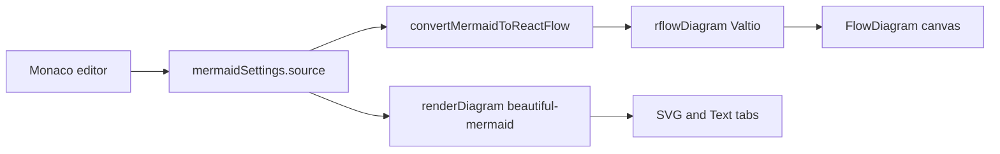

# React Flow canvas in the existing editor shell

## What stays, what changes

The shell in [`src/components/2-main/2-editor-page/0-all/1-editor-page.tsx`](src/components/2-main/2-editor-page/0-all/1-editor-page.tsx) stays: header + resizable **Editor | Preview**.

The right panel gets a third preview mode. Default becomes **Flow**. **SVG** and **Text** keep the current beautiful-mermaid pipeline (render options, ELK popover, source↔diagram linking, copy, existing export dialog).

The left editor stays Monaco + `monaco-mermaid` + Valtio `mermaidSettings.source`, but is used the same way as [albingcj/mermaid-reactflow-editor](https://github.com/albingcj/mermaid-reactflow-editor): **direct `@monaco-editor/react` import, no `React.lazy` / Suspense**.

AI / Gemini is out of scope. Save/load JSON **is** in scope.



**Limitation (same as the reference):** the converter is a custom flowchart parser + Dagre, not Mermaid’s AST. Sequence / class / ER / XY samples will still render on the SVG/Text tabs; the Flow tab will show a conversion error. Canvas edits do **not** write back to Mermaid text; changing the source re-converts and replaces the graph (unless a saved layout is being restored).

## Isolated folder

All ported/adapted reference code lives under **[`src/features/rflow/`](src/features/rflow/)** so it does not mix with `2-panel-diagrams` or `5-render-diagram`. Existing panels only mount thin adapters.

```
src/features/rflow/
  converter/          mermaidToReactFlow, sanitizer, layout/shape constants
  canvas/             FlowDiagram, nodes, editing utils, PNG export
  ui/                 NodeEditor, toolbars, search, LoadDialog, EdgeLabelEditor
  store/              Valtio + Jotai (no React useState for shared UI)
  storage/            saved-diagram persist
  styles/             reactflow + selected-edge CSS
  index.ts
```

Port from the MIT-licensed reference (comment at the top of copied files). Restyle onto **this** project’s shadcn (`src/ui/shadcn`), Sonner, and Tailwind tokens. Do **not** copy their `components/ui` kit, theme hook, toasts, 3-column `AppUI`, or AI feature.

Use **`reactflow@11`** (same as the reference), plus `dagre`, `@types/dagre`, `html-to-image`, and `mermaid` (the converter calls `mermaid.initialize` at module load). Keep `beautiful-mermaid`.

Add a Vite chunk group in [`vite.config.ts`](vite.config.ts) for `reactflow` / `dagre` / `mermaid` so they do not inflate the main vendor bundle.

## State: Valtio vs Jotai

No Providers. New components read stores directly.

**Valtio (shared / persisted / mutable graph)**

- Keep [`mermaidSettings.source`](src/store/2-mermaid-settings.ts) as the single source string (already persisted).
- New `rflowDiagram` in `src/features/rflow/store/1-flow-diagram.ts`: `{ nodes, edges, converting, error, ms, lastAppliedSource }`.
- New `rflowSaved` in `src/features/rflow/storage/`: `{ diagrams: SavedDiagram[] }` persisted to `localStorage` (this app’s pattern; the reference’s `diagramStorage.ts` is a stub and only uses `sessionStorage` in `App.tsx`).
- Extend `OutputFormat` in [`src/store/2-mermaid-settings.ts`](src/store/2-mermaid-settings.ts) to `'flow' | 'svg' | 'text'`, default **`'flow'`**. Existing `ExportFormat` stays `'svg' | 'text' | 'png'` for the beautiful-mermaid export dialog.

**Jotai (ephemeral canvas chrome — same role as `panModeAtom` / export dialog)**

- Load-dialog open, node-editor target, search open, edge-label editor, selection snapshot, export-busy.
- NodeEditor draft fields (label, colors, image) as Jotai atoms reset when a node is opened — not `useState`.

**Conversion subscription** (replaces their `useDiagram` + `App` `useEffect`): a small `RflowConverter` mounted from `EditorPage` that:

1. Debounces `mermaidSettings.source` (300ms, same as SVG).
2. Skips if `source === lastAppliedSource` so load/save of a laid-out graph is not immediately overwritten.
3. Calls `convertMermaidToReactFlow` and writes `rflowDiagram`.
4. Publishes status for the existing status bar when the Flow tab is active.

Canvas `onNodesChange` / `onEdgesChange` write back to `rflowDiagram` (Valtio), not React `useState`.

## Right panel adapter

Touch only the existing preview shell:

- [`1-preview-panel.tsx`](src/components/2-main/2-editor-page/2-panel-diagrams/1-preview-panel.tsx): if `outputFormat === 'flow'`, render `FlowDiagram` (full-height, no `ScrollArea` / CSS `zoom`). SVG/Text keep `RenderView` + current zoom/pan.
- [`2-preview-toolbar.tsx`](src/components/2-main/2-editor-page/2-panel-diagrams/2-preview-toolbar.tsx): tabs **Flow | SVG | Text**. On Flow: hide render-options popover; show save, load, export JSON, canvas PNG. Copy on SVG/Text stays as today.
- [`4-zoom-controls.tsx`](src/components/2-main/2-editor-page/2-panel-diagrams/4-zoom-controls.tsx): hidden on Flow (React Flow `Controls` + MiniMap).
- [`5-status-bar.tsx`](src/components/2-main/2-editor-page/2-panel-diagrams/5-status-bar.tsx): Flow shows conversion error/time and label `reactflow`; SVG/Text keep `beautiful-mermaid` + `previewStatus`.
- Source-link hooks stay wired only to the SVG `RenderView` path.

## Canvas feature port (no AI)

Bring over, then replace their `useState` with the stores above:

- Converter: `mermaidToReactFlow.ts` (~2k LOC), sanitizer, `LAYOUT_SPACING` / `NODE_SHAPES` / alignment constants.
- Nodes: `CustomNode`, `DiamondNode`, `SubgraphNode`.
- `FlowDiagram`: React Flow provider, connect/relink, drop-from-palette, double-click node/edge editors, keyboard search.
- `EditingToolbar`, `PaletteToolbar`, `NodeEditor` (+ `IconSearch` / iconify helper they use), `EdgeLabelEditor`, `SearchControl` / `NodeSearchDialog`.
- `diagramEditingUtils` (align, distribute, z-order, lock, duplicate, delete).
- PNG via `exportReactFlowImage` (`html-to-image`).
- Save current `{ mermaid, nodes, edges }` into `rflowSaved`; Load dialog (this project’s `Dialog`) with list + beautiful-mermaid SVG preview of the saved source; JSON download + upload.

Skip: Gemini, streaming, 3-column panel toggles, their fullscreen overlay, their `MermaidRenderer` (SVG tab already covers that).

## Left editor

In [`1-editor-panel.tsx`](src/components/2-main/2-editor-page/1-panel-editor/1-editor-panel.tsx) / [`2-monaco-editor.tsx`](src/components/2-main/2-editor-page/1-panel-editor/2-monaco-editor.tsx):

- Import `MonacoMermaidEditor` statically; drop `lazy(loadMonacoEditor)` and the editor `Suspense`.
- Keep self-hosted workers + `monaco-mermaid` in [`3-monaco-setup.ts`](src/components/2-main/2-editor-page/1-panel-editor/3-monaco-setup.ts) (better than the reference’s CDN loader).
- Keep Valtio `source` binding, samples dropdown, ELK popover, `useMonacoSourceLink`.
- [`8-lazy-modules.ts`](src/components/2-main/2-editor-page/1-panel-editor/8-lazy-modules.ts): keep **only** `loadBeautifulMermaid` (SVG/Text still lazy). Welcome preload no longer warms Monaco.

## Other small shell updates

- Welcome blurb in [`1-welcome-page.tsx`](src/components/2-main/1-welcome-page/1-welcome-page.tsx): mention the React Flow canvas plus SVG/Text.
- Existing export dialog unchanged for SVG/Text/PNG from beautiful-mermaid.

## Verification

- Flowchart sample: type in Monaco → canvas updates after debounce; drag/edit a node; edit source again and confirm graph resets from conversion.
- Save → reload page → Load restores mermaid + canvas positions without an extra convert clobber.
- Switch Flow / SVG / Text; confirm SVG source-linking and BM export still work.
- Sequence sample: Flow shows a conversion error; SVG/Text still render.
- Light/dark: canvas container follows `appSettings.theme`.
- If browser tools are available, exercise the editor page end to end (not just a screenshot).
