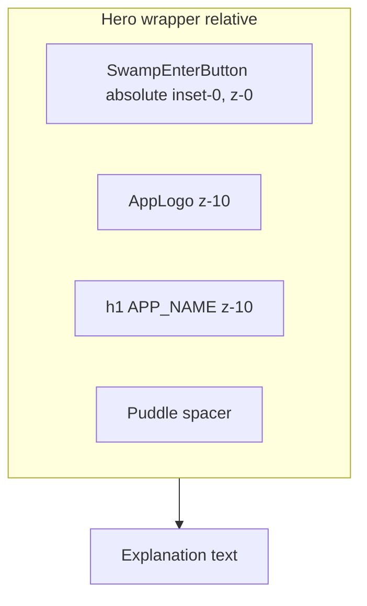

# Swamp puddle "Enter Laboratory" button

## Layout

In [src/components/2-main/1-welcome-page/1-welcome-page.tsx](src/components/2-main/1-welcome-page/1-welcome-page.tsx), put the logo, the `h1`, and the new button inside one `relative` hero wrapper:

- `SwampEnterButton` is the bottom layer. It is `absolute inset-0` inside the wrapper, so it runs from the top of the logo down to where the old button's bottom edge was.
- The logo and title stay in normal flow on top with `relative z-10 pointer-events-none`. The logo keeps its `ViewTransition`, so the morph into the header still works.
- A spacer at the bottom of the wrapper, about 5rem tall, reserves room for the puddle. The explanation paragraph, the checkbox, and the footer stay where they are.
- The wrapper width is `w-full max-w-md`, which matches the paragraph width, so the button takes roughly the same space as the text.

## New files, all under `src/components/2-main/1-welcome-page/`

- `3-swamp-enter-button.tsx` contains the component:
  - An `<svg>` with `viewBox="0 0 400 420"` and `preserveAspectRatio="xMidYMax meet"`, so the puddle stays pinned to the bottom.
  - **Puddle**: a closed `path` made of smooth cubic Bezier curves with an irregular, blobby edge. It is a wide, flat ellipse with a height-to-width ratio of about 0.24, which is what a puddle looks like from about 1.7 m high at about 7 m away (an angle of about 14 degrees).
  - **Puddle fill**: a dark swamp-green radial gradient, a lighter rim stroke, and one or two faint horizontal highlight streaks to suggest a wet surface. A soft blurred shadow ellipse underneath gives the asphalt feel. Colors come from the theme, with separate light and dark variants set through CSS variables or `currentColor`.
  - **Button behavior**: the puddle `path` is wrapped in a `<g role="button" tabIndex={0} aria-label="Enter Laboratory">`. It handles `onClick` and Enter/Space by calling `navigate(AppPage.main)`, and it keeps the current `autoFocus` behavior. On hover or focus, a Motion `whileHover`/`whileFocus` makes the puddle slightly brighter and scales it to about 1.03.
  - **Label**: a centered `<text>` inside the puddle that reads "Enter Laboratory", using `font-heading`, uppercase, and a light color.
  - **Bubbles**: one `SwampBubble` per id from `bubbleIdsAtom`.
- `3-swamp-bubble.tsx` contains `SwampBubble({ id })`:
  - It reads its settings from `bubbleAtomFamily(id)`. The settings are `startX` (a random point inside the puddle), `radius` (8 to 18), `duration` (4 to 7 s), `delay`, `driftX` (a small sideways wobble), and `seed`.
  - **Shape**: a `circle` with a pale green fill at about 10% opacity and a green `stroke-green-600` border.
  - **Highlights**: two white rounded arcs in the upper-left part of the bubble. The first is a semicircular arc that follows the edge. The second is a short arc, about 1/4 the size, placed just after it, as in the reference screenshot.
  - **Motion**: a `motion.g` animates `transform` as keyframes. The `translateY` goes from the puddle surface to `y = 0`, the logo top. The `translateX` wobbles with a random drift. The bubble starts at scale 0.4 as it comes out of the puddle, grows to scale 1, and fades out at the top.
  - When the animation finishes (`onAnimationComplete`), it calls `respawnBubbleAtom` with its `id`, which rerolls the random settings for the next rise.
- `3-swamp-atoms.ts` holds the state, following the atoms-over-`useCallback` rule:
  - `bubbleIdsAtom` holds a list of 2 to 4 ids, chosen once when the atom is created.
  - `bubbleAtomFamily` comes from the existing `jotai-family` package and holds the settings for each bubble.
  - `createRandomBubble(puddleBox)` is a pure helper.
  - `respawnBubbleAtom` is a write-only atom, `atom(null, (get, set, id) => set(bubbleAtomFamily(id), createRandomBubble(...)))`.
  - `puddleHoverAtom` is a boolean. When a derived atom sees it is true, the bubbles rise faster.

## Accessibility and performance

- `useReducedMotion()` from `motion/react`: if the user has turned on reduced motion, the bubbles do not render and the puddle stays still.
- The animation changes only `transform` and `opacity`, so there is no layout thrashing.
- Remove the unused `Button` import from the welcome page.
