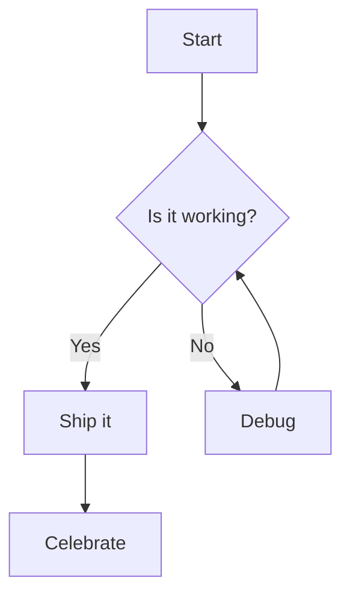
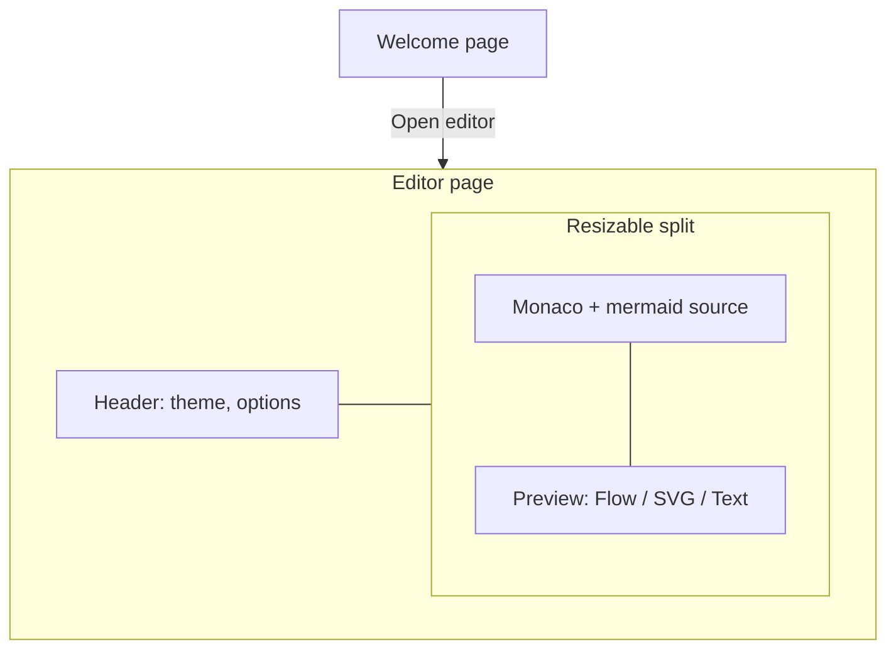
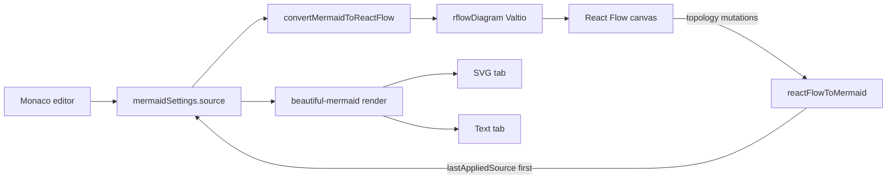
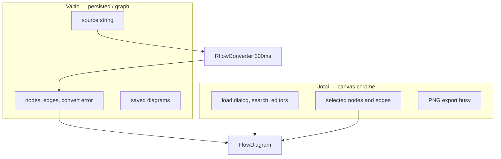

# Mermaid Rflow

A two-panel Mermaid editor: write diagrams in Monaco, then preview them as an editable React Flow canvas, as SVG, or as Unicode/ASCII text.

## Table of contents

- [What it is](#what-it-is)
- [How it works](#how-it-works)
- [How to Build the Project](#how-to-build-the-project)
- [Related projects](#related-projects)

## What it is

**Mermaid Rflow** keeps one Mermaid source string and shows it three ways:

| Preview tab | What you get | Engine |
| --- | --- | --- |
| **Flow** (default) | Interactive nodes and edges you can pan, zoom, drag, connect, restyle, save, and export as PNG/JSON | Custom flowchart parser + [Dagre](https://github.com/dagrejs/dagre) + [React Flow](https://reactflow.dev/) |
| **SVG** | Themed vector diagram, including sequence / class / ER / XY charts | [beautiful-mermaid](https://github.com/lukilabs/beautiful-mermaid) (ELK layout) |
| **Text** | Unicode box drawing or plain ASCII | beautiful-mermaid |

The left pane is a self-hosted [Monaco](https://microsoft.github.io/monaco-editor/) editor with [monaco-mermaid](https://github.com/Yash-Singh1/monaco-mermaid) highlighting. The right pane is a resizable preview. Settings, source, and saved canvases persist in `localStorage`.

The default sample is a small flowchart:



**Flow is flowchart-oriented.** Sequence, class, ER, and XY samples still render on SVG and Text. On Flow they convert poorly or show “no flowchart nodes.” Adding, connecting, deleting, duplicating, and relabeling Flow nodes writes that topology back into the left editor (comments, `classDef`, and original wrapping are not preserved). Drag, align, colors, icons, and images stay on the canvas. Editing the source re-converts and replaces the graph (unless you are restoring a saved layout).

The React Flow converter, canvas, and toolbars live under [`src/features/rflow/`](src/features/rflow/) and were adapted from [albingcj/mermaid-reactflow-editor](https://github.com/albingcj/mermaid-reactflow-editor) (MIT). AI generation from that project is not included.

## How it works

The shell is a welcome screen, then a header plus a resizable **Editor | Preview** split.



One Valtio source string feeds two independent pipelines. Flow conversion is debounced (300 ms). SVG and Text stay on the lazy beautiful-mermaid chunk.



Shared graph data uses **Valtio**. Ephemeral canvas chrome (dialogs, selection, node/edge editors) uses **Jotai**. Components read those stores directly; there is no React Context provider for the diagram.



Ported React Flow code is isolated from the existing SVG/Text panels:

```text
src/features/rflow/
  converter/   mermaid → nodes/edges, React Flow → mermaid, sanitizer, Dagre spacing
  canvas/      FlowDiagram, custom / diamond / subgraph nodes, PNG export, source link
  ui/          palettes, toolbars, NodeEditor, search, LoadDialog
  store/       Valtio graph + Jotai chrome
  storage/     saved { mermaid, nodes, edges } in localStorage
  styles/      React Flow and selected-edge CSS
```

On the **SVG** and **Flow** tabs, clicking a shape can highlight the matching line in Monaco (and the other way around). Flow uses React Flow’s own controls and minimap instead of the SVG zoom bar.

## How to Build the Project

### Prerequisites

- **Node.js** `^20.19.0` or `>=22.12.0` (required by Vite 8)
- **pnpm** (this repo ships `pnpm-lock.yaml`)

### Install

```bash
pnpm install
```

### Develop

```bash
pnpm dev
```

Vite serves the app at [http://localhost:3000](http://localhost:3000).

Optional type-check in watch mode:

```bash
pnpm tsc
```

### Production build

```bash
pnpm build
```

That script:

1. Type-checks with `tsc -b`
2. Runs `upen` (pre-build helper used by this repo)
3. Bundles with Vite into `dist/`

`beautiful-mermaid` (and ELK) load as a separate chunk. Monaco is split into its own file. React Flow, Dagre, and `mermaid` stay with the main vendor chunk so production does not hit circular-chunk init errors.

Preview the production bundle:

```bash
pnpm preview
```

### Other scripts

| Script | Purpose |
| --- | --- |
| `pnpm check:tw` | Check Tailwind class order |
| `pnpm check:tw:fix` | Rewrite Tailwind class order |
| `pnpm to-npm` | Build, then publish `dist/` with `gh-pages` |

## Related projects

Projects this app uses, plus others that are useful if you want to learn how diagrams are parsed, laid out, and drawn.

### Used here

- [albingcj/mermaid-reactflow-editor](https://github.com/albingcj/mermaid-reactflow-editor) — source of the flowchart converter and interactive canvas (MIT). Live demo: [diagram.albingcj.com](https://diagram.albingcj.com/)
- [lukilabs/beautiful-mermaid](https://github.com/lukilabs/beautiful-mermaid) — synchronous SVG and ASCII/Unicode renderer used by the SVG and Text tabs
- [mermaid-js/mermaid](https://github.com/mermaid-js/mermaid) — diagram language; the Flow converter initializes `mermaid` at module load
- [xyflow/xyflow](https://github.com/xyflow/xyflow) — React Flow (`reactflow` v11 in this repo)
- [dagrejs/dagre](https://github.com/dagrejs/dagre) — layered graph layout for the Flow canvas
- [kieler/elkjs](https://github.com/kieler/elkjs) — ELK layout engine bundled inside beautiful-mermaid for SVG
- [microsoft/monaco-editor](https://github.com/microsoft/monaco-editor) — in-browser code editor
- [Yash-Singh1/monaco-mermaid](https://github.com/Yash-Singh1/monaco-mermaid) — Mermaid language and themes for Monaco
- [bubkoo/html-to-image](https://github.com/bubkoo/html-to-image) — canvas PNG export

### Useful for learning about rendering

- [mermaid-js/mermaid-live-editor](https://github.com/mermaid-js/mermaid-live-editor) — official text-first editor at [mermaid.live](https://mermaid.live); good reference for Monaco + official Mermaid SVG
- [Mermaid flowchart syntax](https://mermaid.js.org/syntax/flowchart.html) — node shapes, edges, subgraphs, and directions the Flow parser aims to cover
- [React Flow + Dagre example](https://reactflow.dev/examples/layout/dagre) — minimal Dagre layout on a React Flow graph
- [React Flow + elkjs example](https://reactflow.dev/examples/layout/elkjs) — same idea with ELK (closer to the SVG tab)
- [Eclipse ELK options](https://eclipse.dev/elk/reference/options.html) — knobs this app exposes in the SVG layout popover (node placement, cycle breaking, model order, merge edges)
- [relliv/mermaid-to-reactflow-converter](https://github.com/relliv/mermaid-to-reactflow-converter) — smaller Mermaid → React Flow example
- [vercel-labs/beautiful-mermaid](https://github.com/vercel-labs/beautiful-mermaid) — Vercel fork of beautiful-mermaid (themes and rank-by-rank SVG animation)
- [inkeep/mermaid-wysiwyg](https://github.com/inkeep/mermaid-wysiwyg) — bidirectional visual editing that writes gestures back into Mermaid text (this app writes Flow topology back, not pixel layout or styles)
- [tra-sco/mermify](https://github.com/tra-sco/mermify) — another Monaco + canvas editor with two-way sync for flowcharts and sequence diagrams
